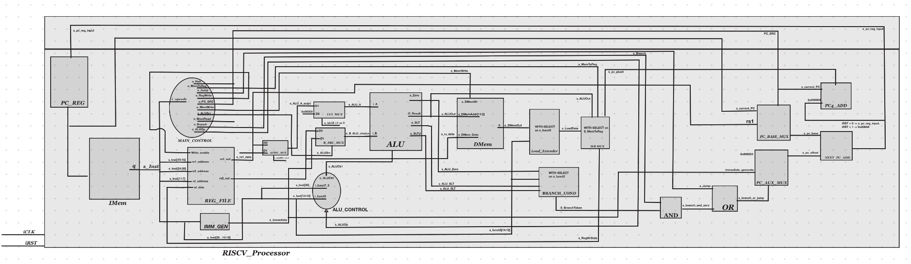

# Single-Cycle RISC-V Processor

A 32-bit RISC-V processor that runs each instruction in a single clock cycle, built completely from scratch in structural/dataflow VHDL. Every piece — ALU, register file, adders, muxes, shifters, control logic — is built at the gate/RTL level instead of using behavioral shortcuts, and it's all verified through simulation.

## What it does

The processor supports a good chunk of the RV32I instruction set:

- **Arithmetic/Logic:** `add`, `addi`, `and`, `andi`, `or`, `ori`, `xor`, `xori`, `sub`, `slt`, `slti`, `sltiu`
- **Shifts:** `sll`, `srl`, `sra`, `slli`, `srli`, `srai`
- **Memory:** `lw`, `lb`, `lh`, `lbu`, `lhu`, `sw`
- **Branches/Jumps:** `beq`, `bne`, `blt`, `bge`, `bltu`, `bgeu`, `jal`, `jalr`
- **Other:** `lui`, `auipc`, `wfi` (used as a halt)

## How it works

Every instruction moves through the datapath in one shot — fetch, decode, execute, memory, and writeback all happen in the same clock cycle.

**Fetch**
The PC register points to the current instruction in `IMem`. There are three possible "next PC" values: PC+4 for normal execution, a branch/jump target from the immediate offset, or the ALU result for `jalr`. A couple of muxes pick the right one depending on whether a branch was taken or a jump happened.

**Decode**
The instruction gets split into its opcode, funct3/funct7, and register fields. The register file reads the two source registers, the immediate generator pulls out and sign-extends the immediate (format depends on the instruction type), the main control unit turns the opcode into all the datapath's control signals, and the ALU control unit figures out the exact ALU operation from funct3/funct7.

**Execute**
The ALU takes two inputs — a register value and either another register or the immediate — and does the operation. `lui` and `auipc` skip the normal ALU-B path since they don't work like the other instructions. Branch conditions (equal, less-than, unsigned versions) are checked separately from the ALU's zero flag so all six branch types work correctly.

**Memory**
Loads and stores use the ALU result as the memory address. For byte/halfword loads (`lb`, `lh`, `lbu`, `lhu`), a load extender sign- or zero-extends the value based on funct3.

**Writeback**
A final mux picks what actually gets written back to the register file — the ALU result, memory data, or PC+4 (for `jal`/`jalr` so the return address gets saved).

## Files

| File | What it is |
|---|---|
| `RISCV_Processor.vhd` | Top-level wiring that connects everything |
| `RISCV_types.vhd` | Shared type/constant definitions |
| `fetch_unit.vhd` | PC register, PC+4 adder, branch/jump target logic |
| `sc_processor_control_unit.vhd` | Main control unit (opcode → control signals) |
| `sc_processor_alu_control.vhd` | ALU control decode (funct3/funct7 → ALU operation) |
| `alu_32.vhd` | 32-bit ALU |
| `addsub_32.vhd` | Adder/subtractor used inside the ALU |
| `carry_lookahead_adderN.vhd`, `cla_block_4bit.vhd`, `full_adder.vhd` | Carry-lookahead adder built from scratch |
| `barrel_shifter.vhd` | Structural barrel shifter for `sll`/`srl`/`sra` |
| `branch_resolver.vhd` | Checks branch conditions for all six branch types |
| `immediate_generator.vhd` | Pulls out and sign-extends immediates |
| `bitextender_12to32.vhd`, `bitextender_20to32.vhd` | Sign/zero extenders |
| `register_file.vhd` | 32x32-bit register file |
| `register_NBit.vhd`, `dffg.vhd`, `source_register.vhd` | Register/flip-flop building blocks |
| `mem.vhd` | Instruction/data memory |
| `mux2t1.vhd`, `mux2t1_N.vhd`, `mux_32to1.vhd` | Mux building blocks used everywhere |
| `decoder_5to32.vhd` | Register address decoder |
| `andg2.vhd`, `org2.vhd`, `xorg2.vhd`, `invg.vhd` | Basic logic gates |

## Testing

I used a custom toolflow to run the design through simulation and check the results against expected output. Every required instruction was tested, including a full pass across all arithmetic/logic, memory, and branch/jump instructions:

Below is a waveform capture showing the fetch/decode/execute signals updating correctly across a running test program (PC updates, branch/jump signals, ALU inputs/outputs, register writes):

I also captured a waveform specifically for a memory store operation to confirm write data, address, and write-enable timing were correct:

Tested with programs that exercise every arithmetic/logic instruction, a control-flow test with nested function calls, and a merge sort implementation to make sure everything works together correctly, not just in isolation.

## Notes

Everything here is built structurally/dataflow-style, no behavioral one-liners — that's why things like the barrel shifter and the adder are built up from basic gates instead of using built-in shift/add functions.
